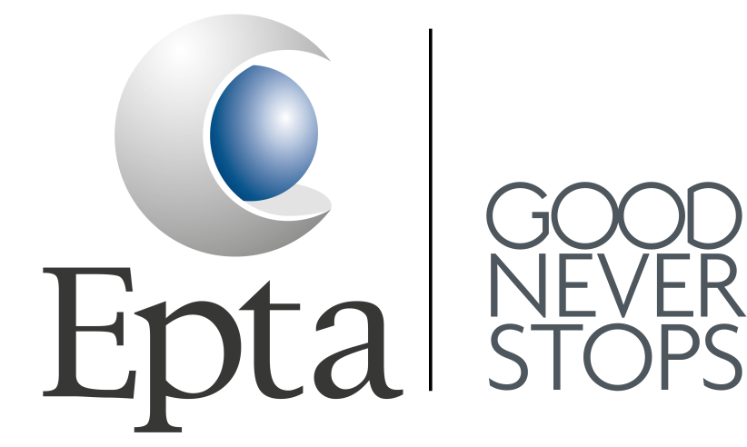
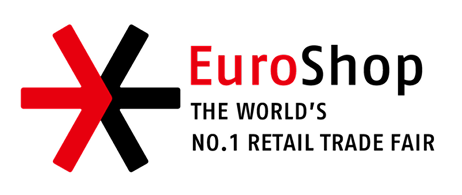
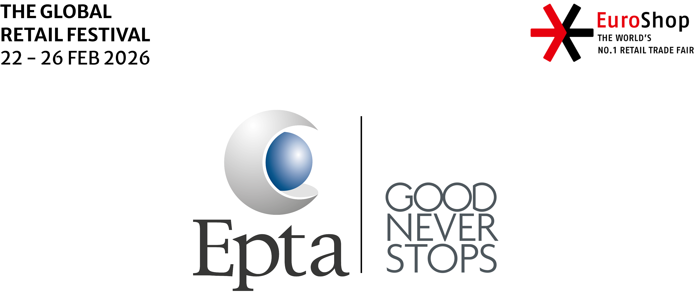

# EPTA Kiosk Q&A





Un experience kiosk in Electron + React per guidare l’utente in un flusso Q&A rapido, con video avatar, selezione lingua e suggerimenti dinamici sul risultato finale.

##✨ Cosa trovi
- Flusso a tre step: hero → domande → risultato finale personalizzato.
- Video idle con autoplay/loop sull’avatar.
- Localizzazione multi-lingua (basata su `src/renderer/data/copy.js`).
- UI full-screen pensata per dispositivi touch/kiosk.



## 🚀 Avvio rapido
```bash
npm install
npm run dev
```
Avvia esbuild in watch e lancia Electron con hot reload.

### Build renderer (solo bundle web)
```bash
npm run build:renderer
```

## 🧭 Struttura essenziale
- `src/renderer/App.jsx` – entry React e orchestrazione schermate.
- `src/renderer/components/` – Hero, Question, Result, BottomBar.
- `src/renderer/data/copy.js` – testi e opzioni per lingue/risultati.
- `src/assets/` – loghi, video avatar, grafiche.

## 🖼️ Asset utili
- Logo principale: `src/assets/logo.svg`
- Tagline: `src/assets/logos.png`
- Evento: `src/assets/event_logo.png`
- Avatar idle: `src/assets/avatar/IDLE.webm`

## 🧪 Consigli per il test
- Verifica autoplay del video idle in Hero (muted/inline abilitati).
- Prova la selezione multipla nella Q2 quando scegli “no-limit”.
- Cambia lingua dal BottomBar e controlla testi e formattazioni.

## 📦 Packaging
```bash
npm run build:renderer
npx electron .
```
Per un pacchetto distribuibile puoi integrare `@electron/packager` o `electron-builder` usando la config in `package.json` (`config.autoUpdate`).

## 🤝 Contributi
Issue e PR sono benvenuti. Mantieni l’aspetto kiosk (fullscreen, touch-friendly) e usa i loader già configurati in esbuild per asset video/srt/png/svg.


